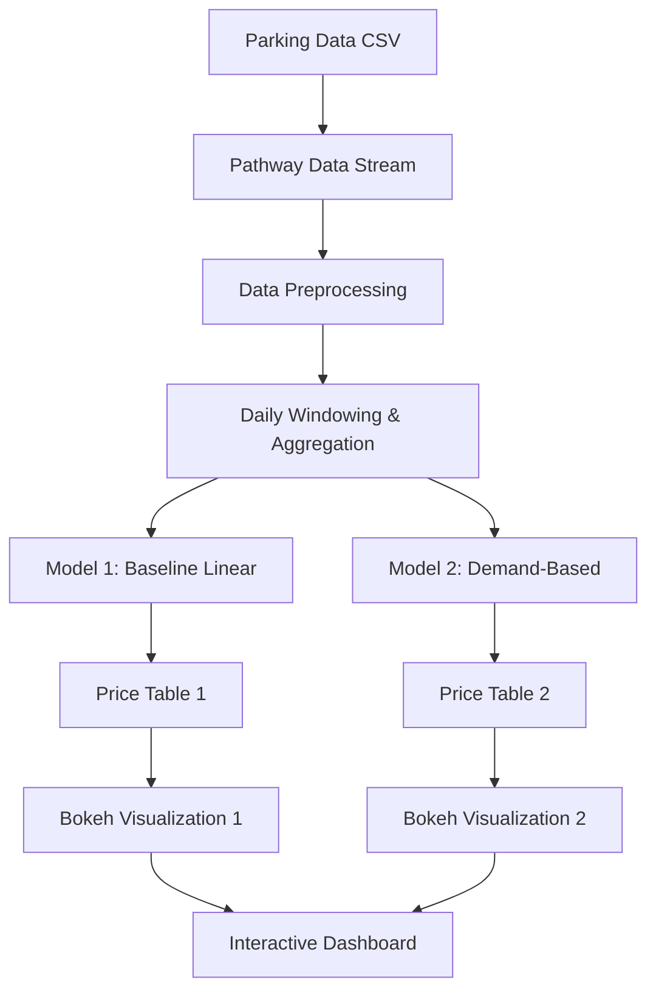

# Dynamic Pricing for Urban Parking Lots

## Project Overview

This project implements a real-time dynamic pricing system for urban parking lots. It leverages a data streaming architecture to process live parking occupancy data, calculate prices based on multiple factors, and visualize the pricing changes in real-time. The system features three increasingly sophisticated pricing models:

1. **Baseline Linear Model**: A simple model based on occupancy and capacity
2. **Demand-Based Model**: An advanced model incorporating occupancy volatility, traffic conditions, and special days

The goal is to create a more efficient parking system by adjusting prices dynamically to reflect current demand and market conditions, ultimately optimizing revenue and resource utilization.

This project is a submission for the Summer Analytics 2025 Capstone Project, hosted by the Consulting & Analytics Club, IIT Guwahati, in collaboration with Pathway.

## Author

- **Name**: Adit Jain
- **Email**: aj9104@srmist.edu.in
- **Mobile**: 8979013467
- **GitHub**: [Adit-Jain-srm](https://github.com/Adit-Jain-srm)
- **Repository**: [SA_CapstoneProject_DynamicPricing](https://github.com/Adit-Jain-srm/SA_CapstoneProject_DynamicPricing)

## Tech Stack

- **Python**: The core programming language for implementation
- **Pathway (≥0.7.0)**: For building the real-time data processing pipeline and streaming analytics
- **Bokeh (≥3.0.0)**: For creating interactive, real-time visualizations of pricing models
- **Pandas (≥1.5.0)**: For data manipulation and preprocessing
- **NumPy (≥1.20.0)**: For numerical operations and calculations
- **Jupyter Notebook**: For structuring the code, analysis, and documentation
- **Google Colab**: As the development and execution environment (optional)

## Architecture and Workflow

The architecture of this project is designed around a real-time data streaming pipeline that processes parking data and applies multiple pricing models.



**Workflow Explanation:**

1. **Data Ingestion**: The system reads parking data from a `dataset.csv` file, treating it as a stream to simulate real-time updates. The data includes occupancy, capacity, timestamps, traffic conditions, special day flags, and competitor pricing.

2. **Data Streaming with Pathway**: The `pathway` library creates a streaming data pipeline that processes data row by row, mimicking a live feed of parking information.

3. **Preprocessing**: Timestamp data is parsed into datetime objects, and other features are normalized and prepared for the pricing models.

4. **Temporal Aggregation**: The stream is windowed into daily tumbling windows. Within each window, key metrics like maximum and minimum occupancy, average traffic conditions, and competitor price trends are calculated.

5. **Multi-Model Pricing Logic**: Three pricing models with increasing sophistication are applied:
   - **Model 1 (Baseline)**: `price = base_price * (1 + current_occupancy/capacity)`
   - **Model 2 (Demand-Based)**: Incorporates occupancy volatility, traffic conditions, and special day factors
   - **Model 3 (Competitive)**: Adds competitor pricing analysis to the demand-based model

6. **Real-time Visualization**: Each pricing model's results are streamed to separate Bokeh plots, which update in real-time to show price fluctuations. These visualizations are combined into an interactive dashboard for easy comparison.

7. **Performance Analysis**: The system tracks key performance indicators for each pricing model, allowing for comparison and optimization.

## Installation and Setup

1. **Clone the Repository**:
   ```bash
   git clone https://github.com/Adit-Jain-srm/SA_CapstoneProject_DynamicPricing.git
   cd SA_CapstoneProject_DynamicPricing
   ```

2. **Install Dependencies**:
   ```bash
   pip install -r requirements.txt
   ```

3. **Environment Options**:
   - **Local Environment**: Run the notebook in your local Jupyter environment
   - **Google Colab**: Upload the notebook to Google Colab (may require additional setup)

## Running the Project

1. **Open the Notebook**:
   Open `SA2025_DynamicPricing_Solution.ipynb` in your Jupyter environment or Google Colab.

2. **Execute the Notebook**:
   Run all cells in sequence to:
   - Load and preprocess the data
   - Initialize the Pathway streaming pipeline
   - Apply the three pricing models
   - Generate the real-time visualizations

3. **Interact with Visualizations**:
   - The Bokeh visualizations will appear in the notebook output
   - You can interact with the plots to explore pricing patterns
   - Compare the performance of different pricing models

## Project Structure

```
├── README.md                         # Project documentation
├── SA2025_DynamicPricing_Solution.ipynb  # Main Jupyter notebook with implementation
├── dataset.csv                       # Sample parking data for simulation
├── problem statement.pdf             # Original project requirements
└── requirements.txt                  # Dependencies for the project
```

## Features and Capabilities

- **Real-time Data Processing**: Processes streaming data with minimal latency
- **Multiple Pricing Models**: Implements three models with increasing sophistication
- **Interactive Visualizations**: Provides real-time, interactive plots for price monitoring
- **Extensible Architecture**: Designed to be easily extended with additional models or data sources
- **Configurable Parameters**: Allows adjustment of base prices, weights, and other parameters

## Future Improvements

- **Machine Learning Integration**: Incorporate ML models to predict demand and optimize pricing
- **Scalability Enhancements**: Extend the system to handle data from multiple parking facilities simultaneously
- **Deployment as Service**: Deploy as a standalone web service with API endpoints
- **Mobile App Integration**: Create companion mobile apps for parking operators and users
- **Historical Analysis**: Add tools for analyzing historical pricing performance

## Acknowledgements

- Consulting & Analytics Club, IIT Guwahati for hosting the Summer Analytics 2025 Capstone Project
- Pathway for providing the real-time data processing framework
- All contributors and mentors who provided guidance and feedback
